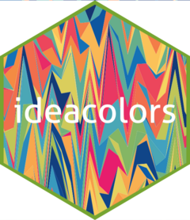

<!-- README.md is generated from README.Rmd. Please edit that file -->

```{r, include = FALSE}
knitr::opts_chunk$set(
  collapse = TRUE,
  comment = "#>",
  fig.path = "man/figures/README-",
  out.width = "100%"
)
```

# ideacolors <a href='https://idea-analytics.github.io/ideacolors'></a>

<!-- badges: start -->
<!-- badges: end -->

The goal of `ideacolors` is simple: to ensure that graphics generated by IDEA Research and Analytics in `R` with `ggplot2` conform to [IDEA's Brand Guidelines (2024)](https://brandfolder.com/ideapublicschools) by providing themes and scales. It uses the palette defined in the 2024 Brand Guidelines document found on pages 19-21. 

Similarly, `ideacolors` also provides a palette defined in the [Camp RIO Branding Guidelines (2022)](https://brandfolder.com/ideapublicschools) on page 7 for visualizations related to Camp RIO.

The point is to help us innovate on the content of our visualizations rather than the look and feel. Indeed, the latter is important in conveying analysis and insights in a familiar way, but it remains more sizzle than steak. 

## Installation

Since this is an internal package, you need to install the development version from [GitHub](https://github.com/) with:

``` r
# install.packages("devtools")
devtools::install_github("idea-analytics/ideacolors")
```
## Examples

Here we can use `scale_idea_colors` and `theme_idea_light`

```{r example, warning=FALSE}
library(ideacolors)

library(tidyverse)

p <- ggplot(mtcars, aes(x=disp, y=mpg)) +
  geom_point(aes(color=as_factor(cyl))) +
  scale_color_idea(palette = "div") +
  theme_idea_light()
  
p
```

And we can change it up with a qualitative color scale and  `theme_idea_min`:

```{r example_2, warning=FALSE}
p + 
  scale_color_idea(palette = "qual") +
  theme_idea_min()
```

If you prefer using the color scheme from the 2019 branding guidelines, add the `year = 2019` argument to `scale_color_idea()` or `scale_fill_idea()`. (Only `year = 2019` or `year = 2024` are allowed.)

```{r example_3, warning=FALSE}
p + 
  scale_color_idea(palette = "qual", year = 2019) +
  theme_idea_min()
```

Using Camp RIO branding guidelines is very similar - instead of `scale_color_idea()` or `scale_fill_idea()`, use `scale_color_camp_rio()` or `scale_fill_camp_rio()`.

```{r example_4, warning=FALSE}
p + 
  scale_color_camp_rio() +
  theme_idea_min()
```

Note that Camp RIO themes are not provided - please use `theme_idea_min()` or `theme_idea_light()`.


## Feedback

If you have questions, comments, or other general feedback, please contact the developers.
