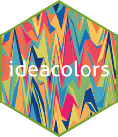
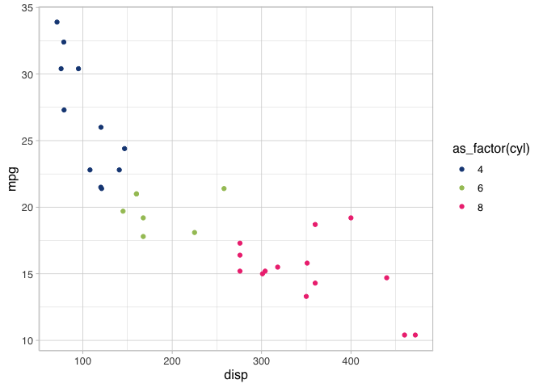
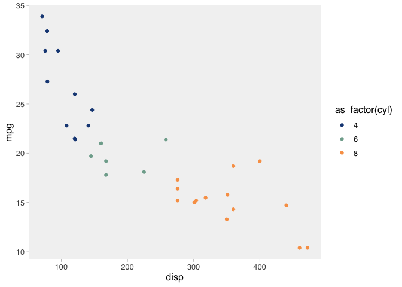

<!-- README.md is generated from README.Rmd. Please edit that file -->

# ideacolors <a href='https://idea-analytics.github.io/ideacolors'></a>

<!-- badges: start -->
<!-- badges: end -->

The goal of `ideacolors` is simple: to ensure that graphics generated by
IDEA Research and Analytics in `R` with `ggplot2` conform to [IDEA’s
Brand Guidelines
(2019)](https://ideapublicschoolsorg.sharepoint.com/:b:/r/sites/MCE/Shared%20Documents/Creative%20Resources,%20Logos,%20and%20Mascots/Brand%20Guidelines/branding_brand_guidelines_10x10_2019.pdf?csf=1&web=1&e=SfZG79)
by providing themes and scales. It uses the palette defined in the 2019
Brand Guidelines document found on pages 21-22.

Similarly, `ideacolors` also provides a palette defined in the [Camp RIO
Branding Guidelines (2022)](https://brandfolder.com/ideapublicschools)
on page 7 for visualizations related to Camp RIO.

The point is to help us innovate on the content of our visualizations
rather than the look and feel. Indeed, the latter is important in
conveying analysis and insights in a familiar way, but it remains more
sizzle than steak.

## Installation

Since this is an internal package, you need to install the development
version from [GitHub](https://github.com/) with:

``` r
# install.packages("devtools")
devtools::install_github("idea-analytics/ideacolors")
```

## Examples

Here we can use `scale_idea_colors` and `theme_idea_light`

``` r
library(ideacolors)

library(tidyverse)
#> ── Attaching core tidyverse packages ──────────────────────── tidyverse 2.0.0 ──
#> ✔ dplyr     1.1.4     ✔ readr     2.1.4
#> ✔ forcats   1.0.0     ✔ stringr   1.5.1
#> ✔ ggplot2   3.5.0     ✔ tibble    3.2.1
#> ✔ lubridate 1.9.3     ✔ tidyr     1.3.0
#> ✔ purrr     1.0.2     
#> ── Conflicts ────────────────────────────────────────── tidyverse_conflicts() ──
#> ✖ dplyr::filter() masks stats::filter()
#> ✖ dplyr::lag()    masks stats::lag()
#> ℹ Use the conflicted package (<http://conflicted.r-lib.org/>) to force all conflicts to become errors

p <- ggplot(mtcars, aes(x=disp, y=mpg)) +
  geom_point(aes(color=as_factor(cyl))) +
  scale_color_idea(palette = "div") +
  theme_idea_light()
  
p
```



And we can change it up with a qualitative color scale and
`theme_idea_min`:

``` r
p + 
  scale_color_idea(palette = "qual") +
  theme_idea_min()
#> Scale for colour is already present.
#> Adding another scale for colour, which will replace the existing scale.
```



You’ll still need to render `README.Rmd` regularly, to keep `README.md`
up-to-date. `devtools::build_readme()` is handy for this. You could also
use GitHub Actions to re-render `README.Rmd` every time you push. An
example workflow can be found here:
<https://github.com/r-lib/actions/tree/master/examples>.

You can also embed plots, for example:


In that case, don’t forget to commit and push the resulting figure
files, so they display on GitHub and CRAN.
